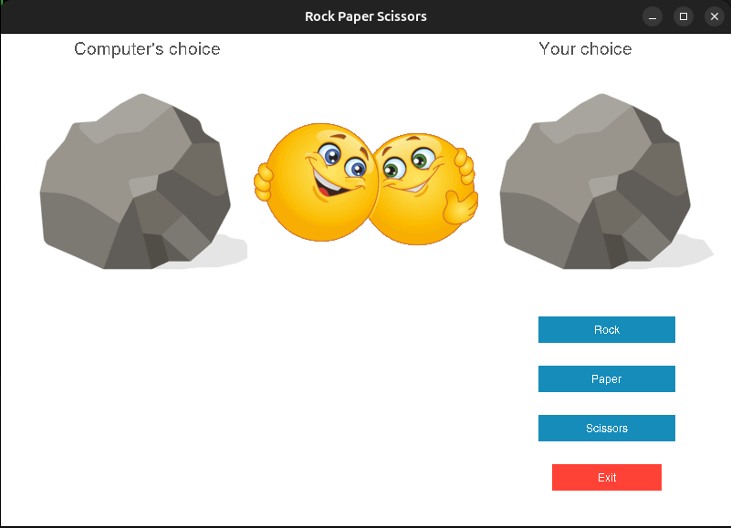

# Rock Paper Scissors Game
This is a Rock-Paper-Scissors game made using python.
## How to play
To run the game execute main.py
```bash
$ python main.py
```
The game window will open

<center></center>

Select your choice of Rock, Paper or Scissors by clicking on the blue colour buttons. User's choice and computer's choice will be shown below corresponding caption. The result will be shown as smiley faces. Their meaning can be seen the table below

<center>
<table border=2>
<tr>
<th>Smiley</th><th>Meaning</th>
<tr>
<tr>
<td></td><td>You won</td>
<tr>
<tr>
<td></td><td>You failed</td>
<tr>
<tr>
<td></td><td>You tied</td>
<tr>
</table>
<br>
</center>

To exit click on the red "Exit" button or close the window
